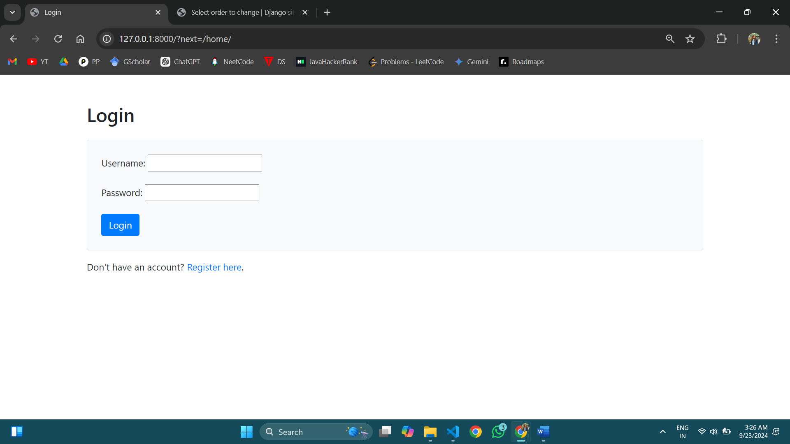
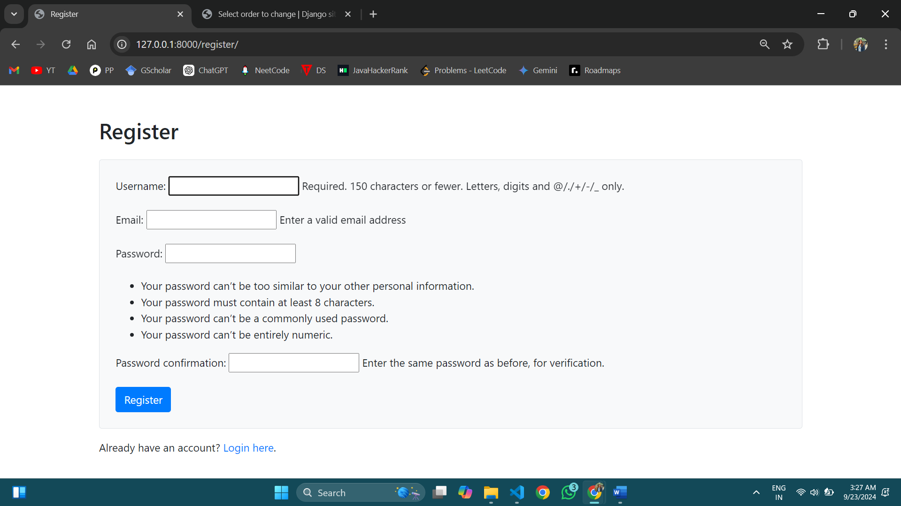
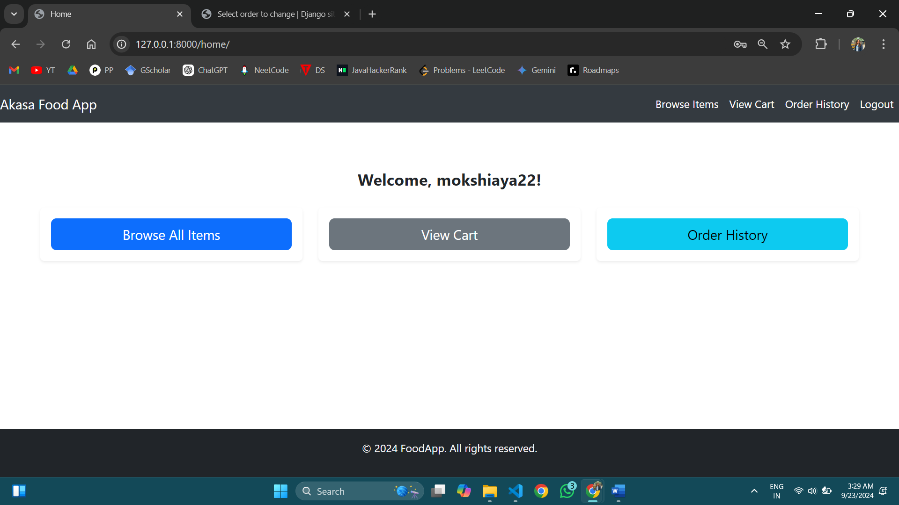
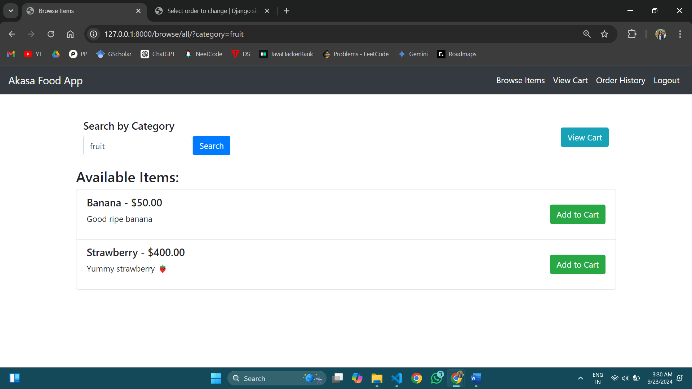
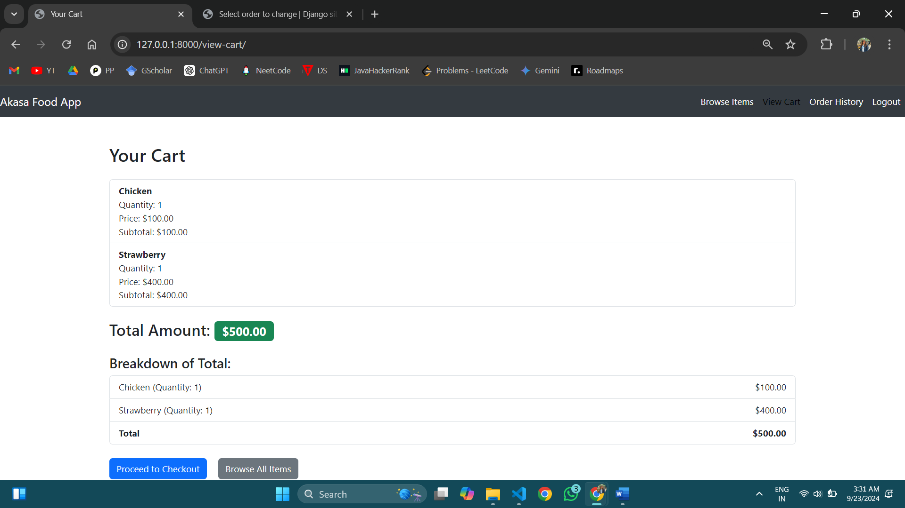
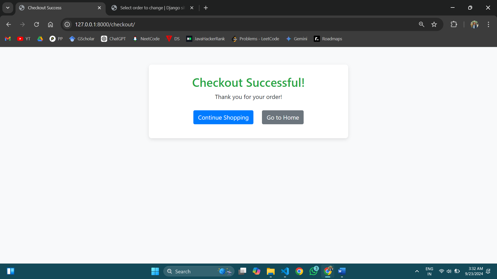
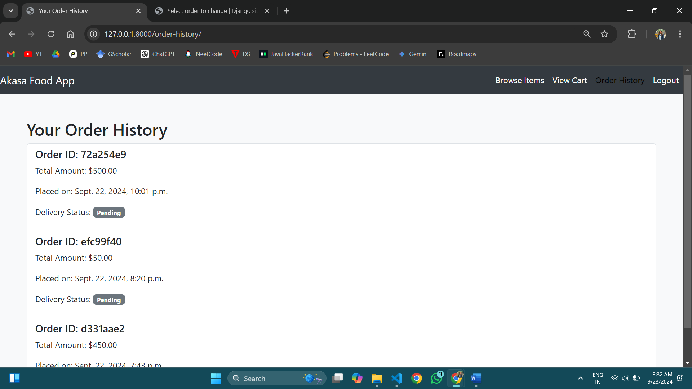

Food Ordering Application
Overview:
The Food Ordering Application is a comprehensive full-stack web solution built using Django, designed to simplify online food ordering. This platform enables users to browse food items, manage a shopping cart, and place orders in a seamless manner. The following document outlines the system's design, technical details, and the steps to run the application.

Design Overview:
The application offers a user-friendly interface with features such as item browsing by category, a persistent shopping cart, and secure user authentication. 
Key features of the platform include:

User Authentication: Secure login and registration using Django's built-in authentication system.
Item Browsing: Allows users to view food items categorized into fruits, vegetables, non-veg, and more.
Shopping Cart: Users can add items to their cart, view cart contents, and proceed to checkout.
Checkout Process: Handles orders securely, updating inventory automatically upon successful purchase.
Order History: Users can view past orders and track previous purchases.
Admin Features: Admins can manage inventory, adjust stock, and oversee orders.

Architecture:
The Food Ordering Application follows the Model-View-Template (MVT) architecture, a standard design pattern in Django. This structure separates the data layer (Models), business logic (Views), and the presentation layer (Templates).
Models: Define the database schema, such as users, items, and orders.
Views: Handle all logic between the models and templates. They control how data is displayed and processed.
Templates: Contain the HTML markup used to render the front-end pages.

User Interface:
Responsive Design: Built with Bootstrap to ensure the application is accessible on a wide range of devices, from desktops to smartphones.
Navigation: The interface features an intuitive navigation bar that enables users to access all the main features like item browsing, cart viewing, and order history.
Features:
User Registration & Authentication :- Users can register, log in, and log out securely.
Item Browsing :- Users can browse food items categorized by types such as fruits, vegetables, non-veg, etc. Detailed item descriptions are provided for each product.
Shopping Cart :- Users can add and remove items from the cart. The cart displays a summary of items and their total cost, providing a seamless checkout process.
Checkout Process :- The platform manages the checkout process securely, including calculating the total cost, updating inventory, and handling the order.
Order History :- Registered users can view their past orders with all relevant details.
Admin Capabilities :- Admins can log in to manage inventory, view orders, and make changes to item availability.

Implementation Details:
Technologies Used:
Backend:- Django (Python) utilizing the Model-View-Template (MVT) design pattern.
Frontend:- HTML5, CSS (inline), and Bootstrap for responsive design.
Database:- SQLite during development.
Cart Management:- The cart is session-based and persistent across logins.
